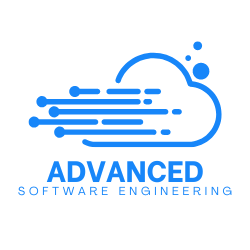

# Advanced Software Engineering
> M.Sc. Cybersecurity, University of Pisa

## Table of contents

- [What is Advanced Software Engineering](#what-is-advanced-software-engineering))
- [License](#license)

## What is Advanced Software Engineering

Advanced Software Engineering is an exam borrowed by the M.Sc. in Cybersecurity of University of Pisa under the name of "Secure Software Engineering".

## License

The code contained in this repository is licensed under the terms of the 2-clauses BSD license.